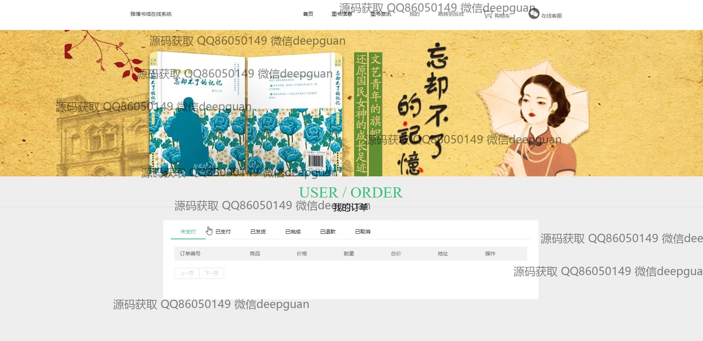
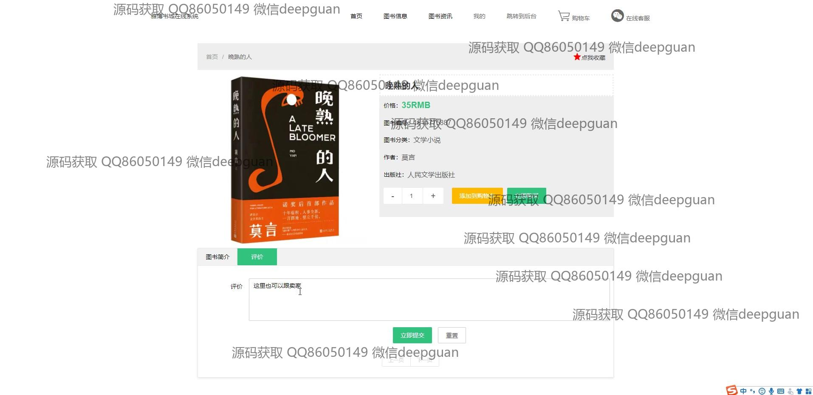

<h1 align="center">的雅博书城图书销售评价系统</h1>

## 简介
雅博书城在线系统：角色分为管理员、用户；提供图书分类管理、用户评价、订单管理、在线客服及支付充值功能，实现图书信息录入与购买评价的便捷操作。    --计算机毕业设计源码；毕设源码；java毕业设计源码

## 联系方式

<h3 align="center">获取完整代码与数据库文件 + 微信：deepguan QQ: 86050149 QQ群: 783742310</h3>

<h3 align="center">可帮忙远程部署 包运行成功！提供远程部署、修改代码、设计文档指导、代码讲解等服务！</h3>

## 功能介绍（完整见运行截图）
管理员：提供导航功能，管理包括用户信息、图书分类、图书信息、订单状态和用户评价。支持图书信息的添加、编辑和删除，并能查看和分析用户评价和图书评分的统计图表，增强管理效率及用户使用体验。通过审核功能确保书籍评价的质量与真实性，同时能够切换到个人中心以修改密码和查看个人信息。

用户：可以注册、登录和查看个人资料，支持搜索和浏览图书，查看详细信息并通过界面进行购买。支持添加图书到购物车或直接购买，能够对已购买书籍进行评价和分享。用户可以管理订单状态，包括查询未支付、已支付、已发货等信息，并通过在线客服实时进行沟通。个人中心允许查看收藏和管理配送地址，确保交易过程的个性化。

评价管理员：管理系统中的评价审核流程，查阅用户评价，决定是否批准。评价信息包括图书评分、评价内容及用户联系方式，支持查看和编辑状态并通过视觉化数据阐述图书表现。功能界面清晰便捷，有助于维护用户信息的准确性和评价的公正性。

客服人员：通过在线客服功能与用户沟通解决问题，包括订单查询、图书信息咨询及支付问题指导。快速响应用户在平台上的问题，优化用户体验，帮助用户顺利完成各类操作。提供地图功能引导用户地址选择，并通过解决实际问题提升用户满意度。

## 运行截图

本代码来源于网络,仅供学习参考使用!

